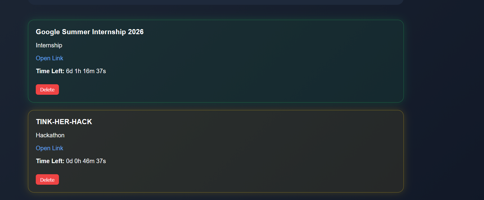
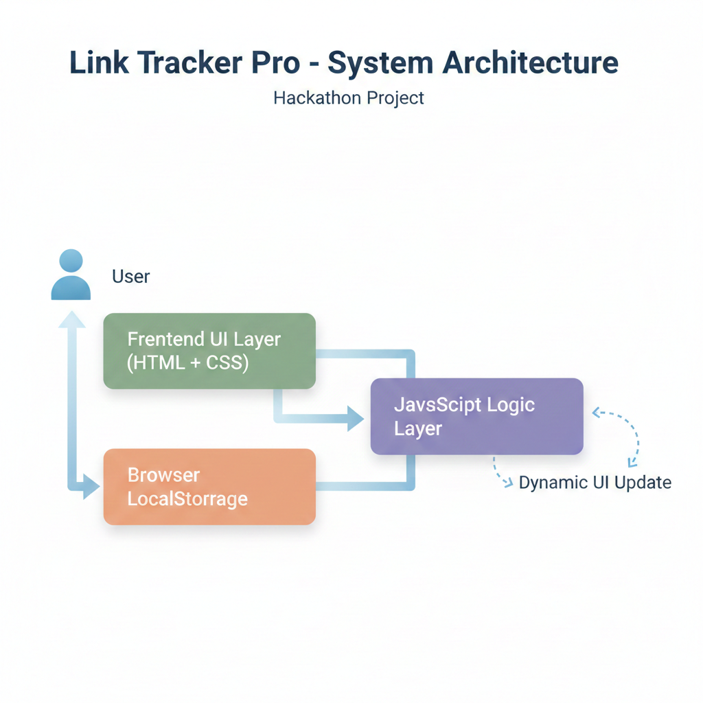
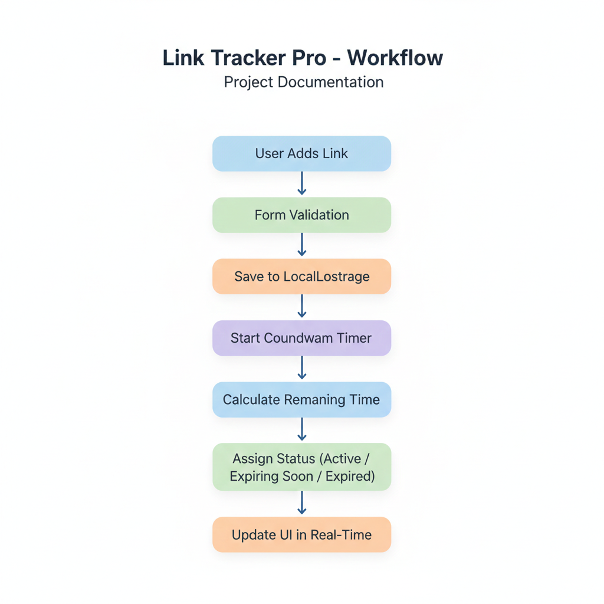

  

# Link-Track pro 🎯

## Basic Details

### Hosted Project Link
[https://deadlink-projectt.vercel.app/]

### Project Description
Link Tracker Pro is a smart web-based application designed to help students and early professionals manage time-sensitive opportunity links such as internships, hackathons, placements, and scholarships.
In today’s fast-paced digital environment, opportunities are shared across multiple platforms including WhatsApp groups, LinkedIn posts, emails, and college portals. As a result, students often save links but forget deadlines, leading to missed career opportunities.
Link Tracker Pro solves this problem by centralizing important links in one organized dashboard with real-time deadline tracking and automated status classification

### The Problem statement
Students receive important opportunity links through multiple platforms like WhatsApp, LinkedIn, and email, but there is no structured way to track their deadlines. As a result, many miss internships, hackathons, and scholarships simply because they forget expiry dates or lose links in scattered sources.

### The Solution
Link Tracker Pro is a centralized web platform that allows users to store opportunity links, set expiry dates, and track deadlines in real time. It automatically categorizes links as Active, Expiring Soon, or Expired and displays a live countdown, ensuring users never miss important opportunities.The system automatically calculates the remaining time and displays a real-time countdown timer. Based on the deadline, each link is dynamically categorized as Active, Expiring Soon, or Expired, with clear visual indicators for urgency.This transforms simple link saving into intelligent deadline management, helping users stay organized, proactive, and aware of upcoming opportunities.

---

## Technical Details

### Technologies/Components Used

**For Software:**
- Languages used: [e.g., HTML , CSS M JAVASCRIPT]
- Frameworks used: No external frameworks were used.
The project is built using Vanilla JavaScript to keep it lightweight, fast, and dependency-free.
- Libraries used: No third-party libraries were used.
The project relies entirely on built-in browser APIs such as:
LocalStorage API
JavaScript Date Object
setInterval() for real-time updates
- Tools used: [e.g., VS Code, Git, Docker]

## Features

List the key features of your project:
--Feature 1: Centralized Link Management
Allows users to store and organize important opportunity links (internships, hackathons, placements, scholarships) in one structured dashboard instead of scattered platforms.

--Feature 2: Real-Time Countdown Timer
Automatically calculates and displays the remaining time (days, hours, minutes, seconds) for each link, updating every second.

--Feature 3: Smart Status Classification
Dynamically categorizes links as Active, Expiring Soon, or Expired based on deadline proximity, helping users prioritize urgent opportunities.

--Feature 4: Persistent Local Storage
Saves all added links in the browser using LocalStorage, ensuring data remains intact even after refreshing or reopening the page.

---

## Implementation

### For Software:

#### Installation
# No installation required
# This is a pure frontend web application.

## Project Documentation

### For Software:

#### Screenshots (Add at least 3)

![Dashboard View] (screenshots/dashboard-view.png) 
This screenshot displays the main dashboard of Link Tracker Pro. It shows all saved opportunity links organized in a clean card layout. Each link includes the title, category, countdown timer, and status indicator (Active, Expiring Soon, or Expired). The pastel glow colors visually highlight urgency levels.

This screenshot demonstrates the live countdown timer feature. The remaining time updates automatically every second. When the deadline approaches, the system automatically changes the status to "Expiring Soon" and eventually to "Expired" once the time is over.

#### Diagrams

**System Architecture:**

Link Tracker Pro follows a client-side web architecture, meaning the entire application runs inside the user’s browser without requiring a backend server.

🧩 Core Components
1️⃣ User Interface Layer (Frontend – HTML & CSS)

Built using HTML5 for structure

Styled with CSS3 for layout and pastel urgency indicators

Displays link cards, countdown timers, categories, and status labels

Handles user interaction through forms and buttons

2️⃣ Logic Layer (JavaScript)

Validates form inputs

Calculates remaining time using the JavaScript Date object

Runs a real-time countdown using setInterval()

Dynamically assigns link status:

Active

Expiring Soon

Expired

Updates the UI automatically without page refresh

This layer acts as the brain of the application.

3️⃣ Data Storage Layer (Browser LocalStorage)

Stores link details persistently inside the browser

Retrieves stored data when the page reloads

Ensures users do not lose saved links

Eliminates the need for a backend database

🔄 Data Flow

The system follows this sequence:

User Input
⬇
Form Validation (JavaScript)
⬇
Save Data to LocalStorage
⬇
Countdown Calculation
⬇
Status Evaluation
⬇
Dynamic UI Rendering

Every second, the logic layer recalculates remaining time and updates the interface accordingly.

⚙️ Tech Stack Interaction

HTML defines the structure of the dashboard

CSS enhances visual clarity and urgency indicators

JavaScript handles logic, time calculations, and dynamic updates

LocalStorage API ensures persistent data storage

All components work together entirely within the browser, making the system:

Lightweight

Fast

Scalable

**Application Workflow:**

The application workflow begins when the user adds an opportunity link along with its title, category, and expiry date. The system validates the input and stores the data in the browser’s LocalStorage.

Once saved, a real-time countdown timer starts automatically. The JavaScript logic continuously calculates the remaining time and dynamically assigns a status — Active, Expiring Soon, or Expired.

The user interface updates instantly without requiring a page refresh, ensuring accurate and continuous deadline tracking.

This workflow ensures automated monitoring, zero manual tracking effort, and real-time visibility of opportunity urgency.

---

### Additional Demos
## Project Demo

### Additional Demos
[Add any extra demo materials/links - Live site, APK download, online demo, etc.]

---

## AI Tools Used (Optional - For Transparency Bonus)

If you used AI tools during development, document them here for transparency:

Tool Used:

ChatGPT

Purpose:

Structuring and refining README documentation

Improving project descriptions and problem statements

Assistance in explaining system architecture and workflow

Debugging JavaScript logic issues

Refining UI wording and presentation script

Key Prompts Used:

“Explain system architecture for a frontend-only web app”

“Write a professional README for a hackathon project”

“Generate workflow explanation for documentation”

“Help debug countdown timer logic in JavaScript”

“Improve presentation script for project demo”

Percentage of AI-Generated Code:

Approximately 10–20%

AI was primarily used for:

Documentation formatting

Minor logic debugging assistance

Core functionality and structure were implemented manually.

Human Contributions:

Complete architecture design

Countdown timer implementation

LocalStorage integration

Status classification logic

UI layout and styling decisions

Feature integration

Deployment setup

Testing and validation

✅ Transparency Statement

AI tools were used strictly as development assistance tools.
All major architectural decisions, logic implementation, and system design were developed by me
---

---

Made with ❤️ at TinkerHub
